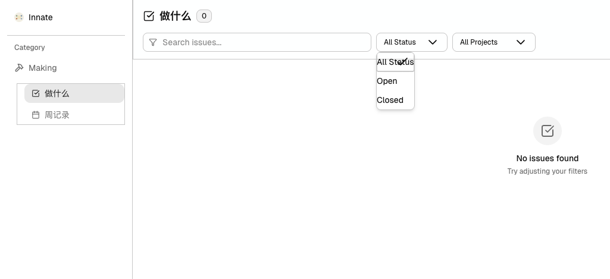

# Task 1: Fix Bug

- 目前页面完全没有数据
- 线框有过于粗了，是否可以参考onur-dev的css，线框都是有点远角的
- 参考下图: Making下面的的线框可以不用，下拉框的数据css面向不对

- 报错修复

```
[browser] Uncaught Error: Hydration failed because the server rendered text didn't match the client. As a result this tree will be regenerated on the client. This can happen if a SSR-ed Client Component used:

- A server/client branch `if (typeof window !== 'undefined')`.
- Variable input such as `Date.now()` or `Math.random()` which changes each time it's called.
- Date formatting in a user's locale which doesn't match the server.
- External changing data without sending a snapshot of it along with the HTML.
- Invalid HTML tag nesting.

It can also happen if the client has a browser extension installed which messes with the HTML before React loaded.

https://react.dev/link/hydration-mismatch

  ...
    <HTTPAccessFallbackBoundary notFound={undefined} forbidden={undefined} unauthorized={undefined}>
      <RedirectBoundary>
        <RedirectErrorBoundary router={{...}}>
          <InnerLayoutRouter url="/making/is..." tree={[...]} params={{}} cacheNode={{rsc:{...}, ...}} ...>
            <SegmentViewNode type="page" pagePath="making/iss...">
              <SegmentTrieNode>
              <ClientPageRoot Component={function IssuesPage} serverProvidedParams={{...}}>
                <IssuesPage params={Promise} searchParams={Promise}>
                  <div className="h-full fle...">
                    <div className="border-b b...">
                      <div className="px-4 py-3">
                        <div className="flex items...">
                          <div className="flex items...">
                            <SquareCheckBig>
                            <h1>
                            <Badge variant="secondary" className="text-xs">
                              <span
                                data-slot="badge"
                                className={"inline-flex items-center justify-center rounded-md border px-2 py-0.5 fon..."}
                              >
+                               0
-                               5
                          ...
                        ...
                    ...
            ...
          ...

    at <unknown> (https://react.dev/link/hydration-mismatch)
    at span (<anonymous>)
    at Badge (../../packages/ui/src/components/ui/badge.tsx:38:5)
    at IssuesPage (app/making/issues/page.tsx:90:15)
  36 |
  37 |   return (
> 38 |     <Comp
     |     ^
  39 |       data-slot="badge"
  40 |       className={cn(badgeVariants({ variant }), className)}
  41 |       {...props}
```
- CSS 再确认，完全使用super的css 风格，card需要一点圆角

