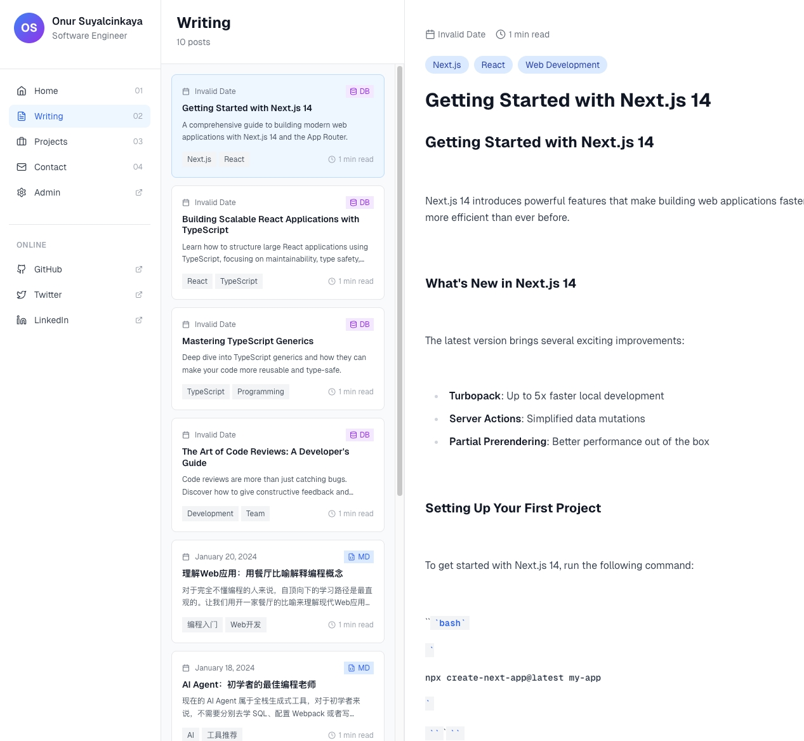
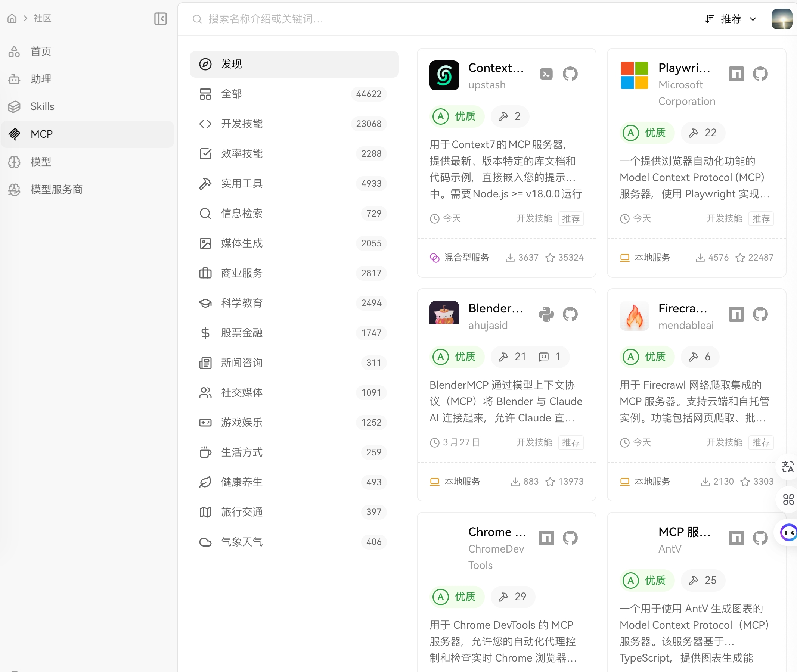
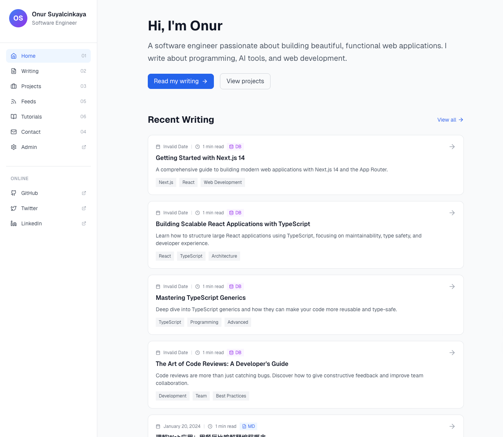

# Task: Realtime ISSUE and Weekly Summarize

目前想做的内容先简化:
关于innate的项目，目前之际做的是实时记录模块和周报总结模块，目前已经开了很多个项目了，每一次提交都会有github issue 提交，然后我就配置这些运行中的所有项目，获取这些issue的描述情况，然后在innate 的Log栏目里面全部记录，然后Weekly栏目里面做几件事情，1. 总结这周做的所有事情，然后AI来评估这些做的事情的优缺点，指出哪些需要改进和优化的点 2. 对我这个人进行评估，感受我的思维，有哪些好处和坏处 4. 这个启动完全有可行性，目前已经构建了一套cli 这个方式，自动运行AI Agent，然后task内容创建issue，执行提交代码，close issue。 那么也就是我可以在多个repo中都这么操作，然后在Log中可以分不同的项目获取记录，并且可以是一个完全托管在github pages上的项目，你的看法是什么？

在当前结构上面做什么:
1. Sidebar保留，先去掉目前所有的东西，只新增一个Making栏位
2. 中间的Category 格式保留，只创建一个Making分类，然后下面就是两个子分类，一个是做什么，一个是周记录
3. 做什么中，就是如上面把所有个github issue 放在这里面
4. 周记录就是分析这一周github issue做的事情，然后AI来评估这些做的事情的优缺点，指出哪些需要改进和优化的点 2. 对我这个人进行评估，感受我的思维，有哪些好处和坏处 
5. 页面布局参考:
   1. 做什么模块：issue 按照项目分类，issue上面都有tag，最上面主页面可以有过滤器，下面所有的issue可以按照时间，项目进行筛选,主内容中支持card和list模式，list模式参考下图：

card mode 参考：

   2. 周记录模块布局是：一个周的标题，然后主要内容在右边展示，参考图片:

6. Home page 布局现在参考：

把最新的更新按照时间顺序排序，分两个部分，一个是做什么，一个是周记录，周记在前面，两个一排，最多展示4个，下面有个more的连接，点击之后进入到周记全部的列表中去，做什么部分也是同理但是有分页展示，点击全部就去做什么页面，点击具体的一个，就去周记页面，分屏幕展示
7. 因为实际上变成了4column形式，可以考虑折叠方式，总体sidebar和category这个宽度开始小一点，尤其是category这个。

## Task 2: 模块优化

1. 当前情况数据看起来都不是最新的，因此需要实现一个抓去github repo issue信息的功能
2. 信息实现可以分两种:
   1. 直接用Github 接口获取，这个可以通过配置从那个org项目获取这个org项目的所有项目除了.github这个项目
   2. 然后实时获取所有的issue情况，然后在innate 的Log栏目里面全部展示
   3. 也可以通过一个job定时来获取这些issue保留到本地一个目录，然后完全静态的处理这个网站
   4. 可以通过github action来处理这个获取issue保留到本地，好处是如果有些issue存在了，那么就可以不在访问github去获取了，这个需要考虑获取方式，需要一个对比的记录过程，记录下每次获取的issue情况，然后对比是否有新的issue出现，如果有新的issue出现，那么就更新到保存文件
   5. 当然也可以完全通过features目录直接展示，但是不好的是，Issue中有很多AI分析生成的内容，因此：
     1. 要么在AI执行任务的时候直接子在另外一个目录中生成提交给github内容的东西
     2. 要么就是通过1，2，3，4这样的方式来报错
    6. 我比较倾向于4这个方式，因为可以在本地仓库也可以有保存，还是一个完全static的网站，比较方便部署到github pages里面
3. 目前我想做最简单的github pages部署的方式，请帮我完成这个目的
4. 同时目前UI的列表和card 都有了，但是点击进去主要内容没有展示的，这个问题也要修复
5. 同样周记录这块因为没有用AI对本周进行的东西进行分析，所以内容有点虚假，需要实现一个AI对本周内容进行分析的功能
6. Layout的内容card和栏位的分割不太精致，需要参考
，点击了一个具体的Log也需要打开参考这个布局